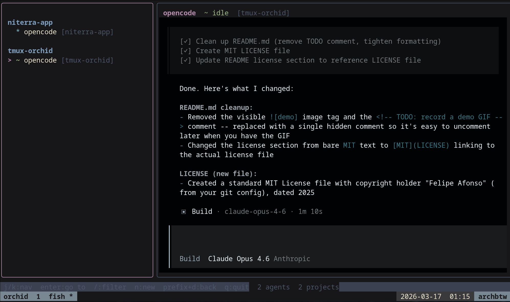

# tmux-orchid

A tmux-native TUI dashboard for AI coding agents.

Monitor, navigate, and spawn AI agents (Claude Code, OpenCode, Codex, Aider,
Gemini, Goose, Amp, and more) running across your tmux sessions -- all from a
single dashboard.



## Features

- **Auto-detection** of 13 AI agent types by process name, command line, and
  process tree walking
- **Status inference** (idle, thinking, tool use, error, done) by scraping
  pane content
- **Project grouping** by git root -- agents in the same repo are grouped
  together
- **Live updates** via configurable polling interval
- **Spawn dialog** to launch new agents in a dedicated tmux session
- **Filter** agents by name, session, or path
- **Switch** directly to an agent's tmux pane with Enter
- **Platform support** for Linux and macOS

## Install

### From source (requires Go 1.23+)

```bash
git clone https://github.com/anomalyco/tmux-orchid.git
cd tmux-orchid
make install        # installs to /usr/local/bin
```

Or install to a custom prefix:

```bash
make install PREFIX=~/.local
```

### Just build

```bash
make build          # binary at bin/tmux-orchid
```

## Usage

Run inside any tmux session:

```bash
tmux-orchid
```

### Key bindings

| Key              | Action                                      |
|------------------|---------------------------------------------|
| `j` / `k`       | Navigate up/down                             |
| `Up` / `Down`    | Navigate up/down                             |
| `Enter`          | Switch to agent's tmux pane (quits the TUI) |
| `/`              | Filter agents                                |
| `n`              | Spawn new agent dialog                       |
| `Esc`            | Clear filter / go back                       |
| `q` / `Ctrl+C`  | Quit                                         |

### Spawn dialog

Press `n` to open the spawn dialog:

1. **Pick an agent** -- only agents found on your PATH are shown
2. **Pick a project directory** -- choose from detected project roots or your
   current directory
3. A new tmux session is created with the agent running in the chosen
   directory

## Configuration

Optional config file at `~/.config/tmux-orchid/config.toml`
(or `$XDG_CONFIG_HOME/tmux-orchid/config.toml`):

```toml
# How often to poll tmux for changes (100ms to 1m)
poll_interval = "2s"

# Path to tmux binary (default: "tmux" via PATH)
# tmux_path = "/usr/local/bin/tmux"

# Only scan these tmux sessions (empty = all)
# session_filter = ["dev", "agents"]

[theme]
# "dark", "light", or "auto"
color_scheme = "auto"

[log]
# "debug", "info", "warn", "error"
level = "info"
# Log to file instead of /dev/null (useful for debugging)
# file = "/tmp/tmux-orchid.log"
```

## Detected agents

| Agent        | Binary / Pattern     |
|--------------|----------------------|
| Claude Code  | `claude`, `claude-code` |
| OpenCode     | `opencode`           |
| Cursor       | `cursor`             |
| Windsurf     | `windsurf`           |
| Aider        | `aider`              |
| Copilot      | `copilot`            |
| Codex        | `codex`              |
| Gemini CLI   | `gemini`             |
| Claude-MD    | `claude-md`          |
| Goose        | `goose`              |
| Amp          | `amp`                |
| Kilo Code    | `kilo`               |

## Development

```bash
make check          # fmt + vet + test + build
make test           # tests with race detector
make fmt            # format with gofumpt
make vet            # go vet
make tidy           # go mod tidy
make clean          # remove build artifacts
```

## Architecture

```
tmux-orchid/
  main.go           entry point: config, state manager, TUI
  config/           TOML config loading and validation
  detector/         agent type classification + status detection
    proctree_linux.go   /proc-based process tree walking
    proctree_darwin.go  ps/lsof-based process tree walking
  state/            polling state manager, git root grouping, diffing
  spawner/          tmux session creation for new agents
  tmux/             tmux binary client (list-panes, capture, switch)
  tui/              Bubble Tea TUI (sidebar, detail, status bar, dialogs)
```

## License

[MIT](LICENSE)
